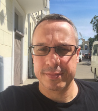

# Evgeny Chukhnov

Address: | Minsk, Belarus
tel: | +375 44 554 04 33	
E-mail: | evgenych@gmail.com
Birthday: | 29.08.1974
Marital Status: | Single

## Skills:
* HTML, CSS, JS

## Experience:
* 2020 - present time - First Step Ltd - head of the department for work with Russian-speaking families
* 2018 - 2020 - Sadot Bar Ltd - consultant for the analysis and construction of business processes
* 2014 - 2018 - Nimteko Ltd - System Administrator
* 2012 - 2014 - The World of Fitness Ltd - Personal Coach
* 2008 - 2012 - individual trainer (individual entrepreneur, work with private clients mainly in Herzliya-Pituah, Raanana, Tel Aviv and the suburbs)
* 2007 - 2008 - director of the shoe store "Karavel Shoes" (Raanana)
* 2003 - 2005 - "אחון - שיווק וקידום מכירות" - Sales Director
* 1995 - 1997 - saxophonist in various ensembles in Minsk (popular music, jazz)

## Education:
* 2021 - Cours JS (IT-Academy, Republic of Belarus, Minsk)
* 2020 - Course HTML CSS (IT-Academy, Republic of Belarus, Gomel)
* 2017 - Course "Development of WEB-oriented applications on Java" (IT-Academy, Republic of Belarus, Minsk)
* 2014 - Course "Development of WEB-oriented applications on PHP" (Center for Educational Technologies "Belhard")
* 2010 - School of Trainers and Instructors at the Orde Wingate Institute for Physical Education and Sports - course "health of the spine"
* 2009 - "Great Shape" Ltd  - a course "personal fitness trainer".
* 2008 - "Siim" - sports school of the Tel Aviv University (course bodybuilding instructor)
* 2007-2008 - "Siim" - sports school of the Tel Aviv University (course fitness-instructor)
* 2001-2002 - service in The Israel Defense Forces (Sergeant major in reserve)
* 1999-2001 - Jerusalem Academy of Music and Dance named after Rubin (jazz, saxophone)
* 1991-1995 - Minsk Musical College named after Glinka (saxophone)
* 1992 - 1997 - Professional Boxing Club "Athletic", course "instructor in kick-boxing and Thai boxing", coaching
* 1989-1991 - secondary school
* 1981-1989 - RSHIMII (Republican Boarding School for Music and Fine Arts named after Akhremchik)

## Foreign language:
- Russian (native)
- Hebrew (free)
- English (intermediate)

## Interests:
* Computers, sports, music, philosophy, foreign languages